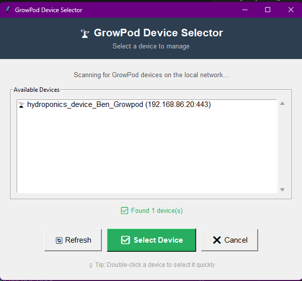
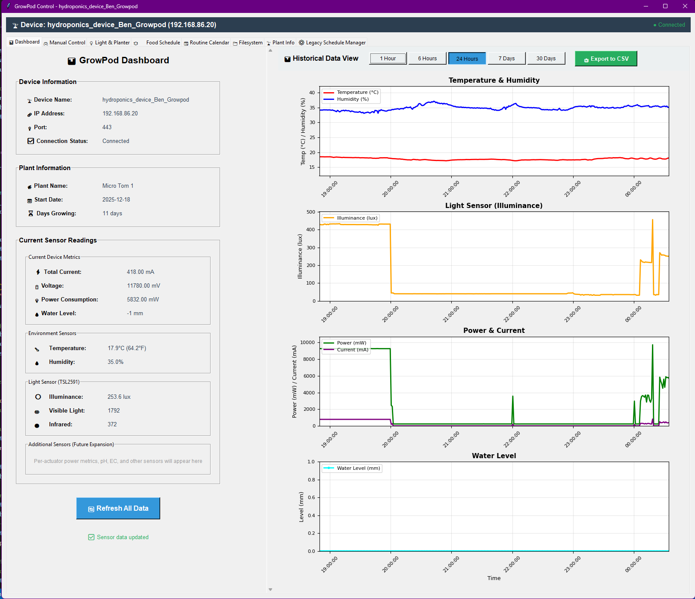

# GrowPod - Scalable Deep Water Culture System

[](https://www.espressif.com/en/products/socs/esp32-s3)
[](https://github.com/espressif/esp-idf)
[](LICENSE)

An intelligent, energy-efficient deep water culture (DWC) hydroponic system designed for scalable at-home food production and scientific plant research. Built on ESP32-S3 with custom peristaltic pumps and Adafruit electronics for maximum efficiency and water recycling.

## � Recent Updates (December 2024)

### Python GUI Console Improvements
1. **Advanced LED Control Panel** - Added expandable individual channel control for 4-channel LED arrays
   - Toggle between unified control (all channels together) and individual channel mode
   - Bidirectional synchronization: adjusting any control updates all related controls
   - Preset buttons (OFF/50%/100%) work in both modes
   - Real-time PWM value display for each channel

2. **Fixed Command Log UI** - Relocated scrollable command log to left sensor panel
   - Commands no longer push buttons around when results appear
   - Color-coded log entries (green for success, red for errors, blue for info)
   - Timestamps for each command execution
   - Fixed position ensures stable, professional UI layout

3. **Auto-Refresh Implementation** - Automatic sensor data updates in Manual Control tab
   - Consistent 5-second refresh rate matching Dashboard behavior
   - Properly scoped closure functions prevent variable capture bugs
   - Tab-aware: auto-refresh pauses when switching away from active tabs

## �🎯 Mission

**Efficiency-First Hydroponics**: Create a low-power, water-recycling hydroponic system that maximizes yield while minimizing resource consumption. Perfect for home food production and laboratory plant research.

## 🌱 Current System (Prototype)

### Core Components
- **Source Pump**: Custom peristaltic pump for fresh water/nutrient intake
- **Drain Pump**: Custom peristaltic pump for water recycling and disposal
- **Circulation Pump**: Periodic water circulation to perlite-filled growing vessel
- **Power Monitoring**: Real-time energy consumption tracking (INA219)
- **Water Management**: Custom PCB level sensing and flow monitoring for complete water cycle control

### Growing Method
- **Deep Water Culture (DWC)** with perlite growing medium
- **Water Recycling**: Closed-loop system minimizing waste
- **Automated Circulation**: Timed water delivery to root zone

### Hardware Design
- **Custom Peristaltic Pumps**: Self-designed for precision and reliability
- **Custom Level Sensing PCB**: Exposed trace design with I2C GPIO expander for water level detection
- **Adafruit Electronics**: ESP32-S3 Feather, INA219 current sensor, 5V buck converter, I2C motor controller
- **ESP32-S3 Brain**: Low-power microcontroller with Wi-Fi connectivity
- **Modular Architecture**: All components designed for easy modification and scaling

## 🔮 Future Vision

### Near-term Goals
- **Automated Water Changes**: Source and drain pump coordination for fresh nutrient cycling
- **Feeding Modules**: Automated nutrient dosing systems
- **Advanced Scheduling**: Light intensity and duration optimization

### Long-term Vision
- **AI Plant Recognition**: Computer vision for automated plant health assessment
- **Adaptive Care**: Machine learning for optimal light, nutrients, and environmental control
- **Scientific Integration**: Research-grade data collection for plant growth optimization
- **High-Yield Production**: Focus on maximizing fruit production in minimal space

### Target Applications
- **Home Food Production**: Fresh, high-yield fruits and vegetables year-round
- **Laboratory Research**: Controlled environment plant studies with precise data collection
- **Educational Tools**: Teaching hydroponics and plant science
- **Sustainable Agriculture**: Low-power, water-efficient growing systems

## 🏗️ Technical Features

### Energy Efficiency
- **Low-Power Design**: Optimized for minimal energy consumption
- **Power Monitoring**: Real-time tracking of system energy usage
- **Smart Scheduling**: Automated timing to reduce unnecessary operation

### Water Management
- **Complete Cycle Control**: Monitor and control all water movement
- **Custom Level Sensing**: PCB-based water level detection using exposed traces and I2C GPIO
- **Flow Monitoring**: Track water usage and system efficiency
- **Recycling Focus**: Minimize waste through intelligent water reuse

### Monitoring & Control
- **Real-time Display**: Local TFT screen showing system status and sensor data
- **Web Interface**: HTTPS server for remote monitoring and control
- **UART Console**: Direct command-line access for debugging and calibration
- **Data Logging**: Track system performance and plant growth metrics

### Python GUI Console (New!)
- **Device Discovery**: Automatic mDNS/Zeroconf discovery of GrowPod devices on local network
- **Multi-Tab Interface**: Dashboard with real-time graphs, Manual Control for direct actuator management
- **Historical Data Viewer**: SQLite-backed sensor data with time-range selection (1h, 6h, 24h, 7d, 30d)
- **Manual Actuator Control**: Individual PWM control for all actuators with preset buttons
- **Advanced LED Control**: Expandable individual channel control for 4-channel LED arrays with bidirectional sync
- **Scrollable Command Log**: Color-coded command results with timestamps for easy debugging
- **CSV Export**: Export historical sensor data for analysis
- **Auto-Refresh**: Configurable automatic sensor data updates

## 📸 Screenshots

### GrowPod Device Selector
Auto-discovers devices on your local network using mDNS/Zeroconf:



### Dashboard View
Real-time sensor monitoring with historical graphs:



### Manual Control Panel
Direct actuator control with advanced LED channel management:


## 🔧 Hardware Setup

### Core Electronics
- **ESP32-S3-DevKitC-1** - Main microcontroller
- **[Adafruit INA219](https://www.adafruit.com/product/904)** - High-side DC current sensor for power monitoring
- **[Adafruit 1.14" TFT Display](https://www.adafruit.com/product/4383)** - ST7789 240x135 local status display
- **Custom Level Sensing PCB** - Exposed trace design for water level detection
- **Custom Peristaltic Pumps** - Self-designed water movement control

### Adafruit Components Used
- **[ESP32-S3 Feather](https://www.adafruit.com/product/5483)** - Main microcontroller board
- **[INA219 Current Sensor](https://www.adafruit.com/product/3650)** - High-side DC current sensing
- **[5V Buck Converter](https://www.adafruit.com/product/4739)** - Step-down converter from 12V DC barrel jack
- **[MCP23017 I2C GPIO Expander](https://www.adafruit.com/product/5346)** - GPIO expansion for level sensing PCB
- **[TB6612 PWM Driver](https://www.adafruit.com/product/2927)** - I2C PWM motor controller for pump control

### Power System
- **12V DC Input**: Standard barrel jack connector for main power
- **5V Buck Conversion**: Adafruit buck converter steps down 12V to 5V for system power
- **Pump Control**: PCA9685 provides PWM signals for custom peristaltic pumps

### Pump Configuration
- **Source Pump**: Fresh water/nutrient intake via TB6612 PWM control
- **Drain Pump**: Water disposal and recycling via TB6612 PWM control  
- **Circulation Pump**: Periodic water delivery to growing vessel via TB6612 PWM control

### Sensor Network
```
I²C Bus:
- SDA: GPIO 8
- SCL: GPIO 9
- INA219 (Power monitor)
- MCP23017 (GPIO expander for level sensing)
- TB6612 (PWM motor controller)

Display (SPI):
- MOSI: GPIO 35, CLK: GPIO 36
- CS: GPIO 7, DC: GPIO 39
- RST: GPIO 40, PWR: GPIO 21

Power:
- 12V DC Barrel Jack Input
- 5V Buck Converter (Adafruit #4739)
```